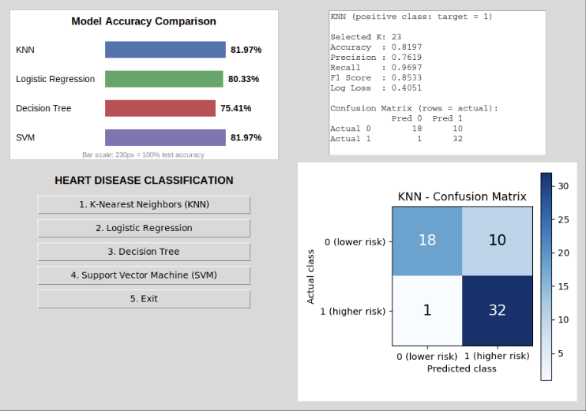
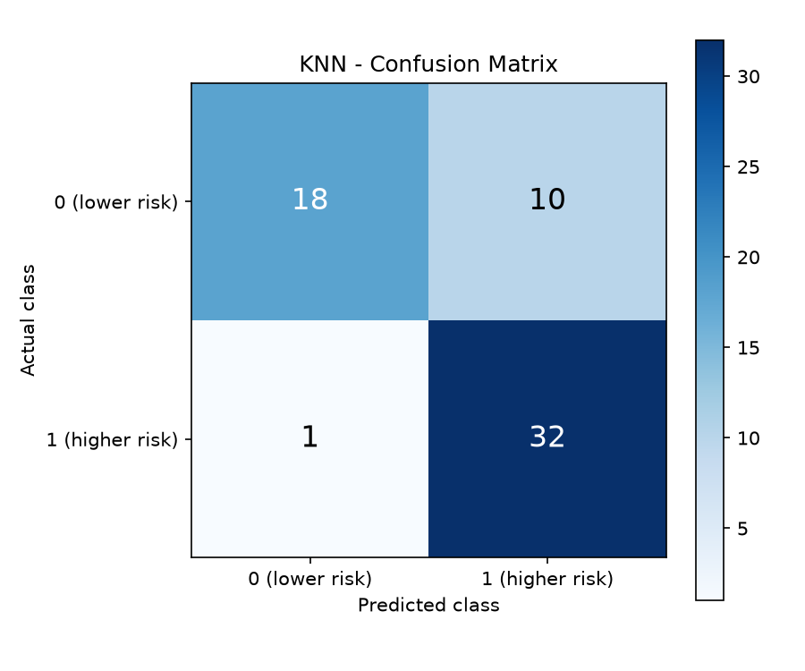
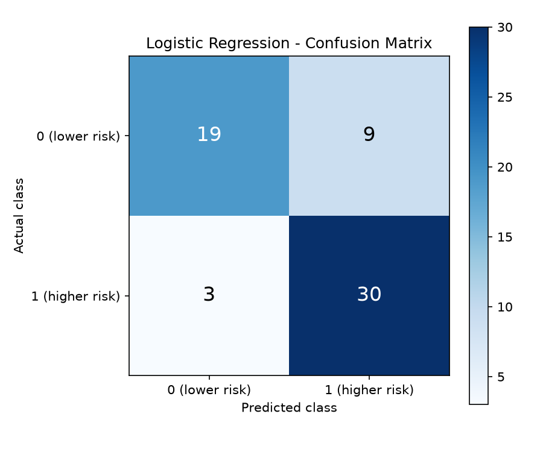
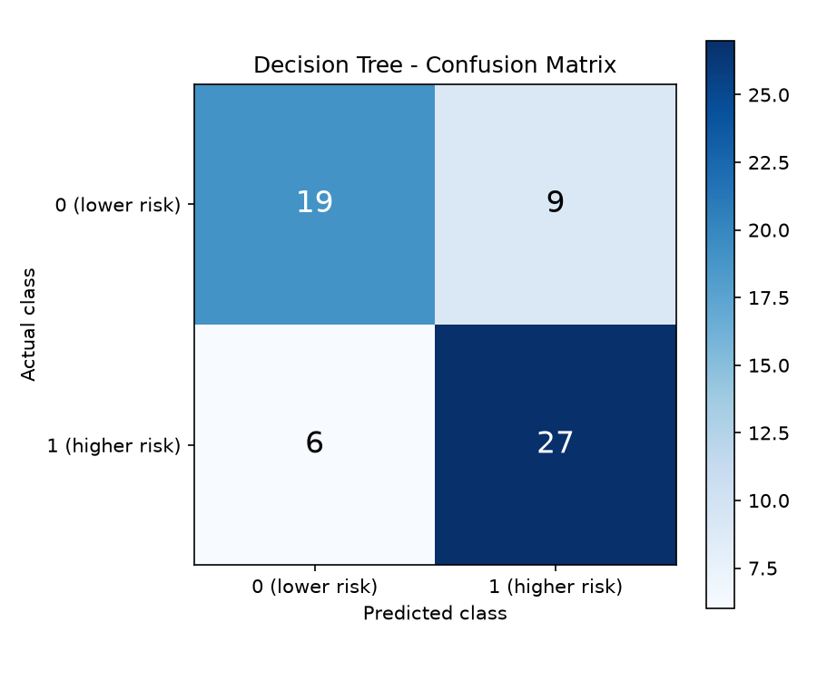
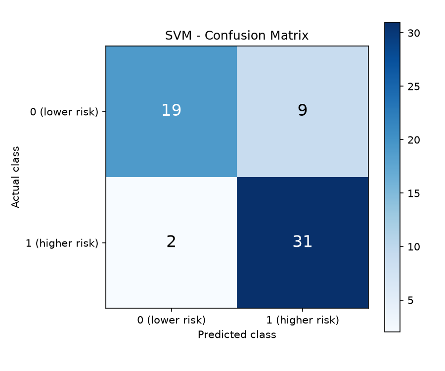

# Heart Disease Classification ❤️

A beginner-friendly Machine Learning project that compares four classification algorithms for heart disease prediction.

## 🖥️ GUI Preview



## 📊 Model Comparison

<table>
  <tr>
    <td align="center"><b>KNN</b></td>
    <td align="center"><b>Logistic Regression</b></td>
    <td align="center"><b>Decision Tree</b></td>
    <td align="center"><b>SVM</b></td>
  </tr>
  <tr>
    <td></td>
    <td></td>
    <td></td>
    <td></td>
  </tr>
</table>

## 🤖 Algorithms

* K-Nearest Neighbors (KNN)
* Logistic Regression
* Decision Tree
* Support Vector Machine (SVM)

Models are evaluated using Accuracy, Precision, Recall, F1 Score, Log Loss, and Confusion Matrices.

## ⚙️ Installation & Usage

Install the required libraries:

```bash
pip install pandas numpy matplotlib scikit-learn
```

Run the application:

```bash
python main.py
```

## 🛠️ Technologies

Python · Pandas · NumPy · Scikit-learn · Matplotlib
